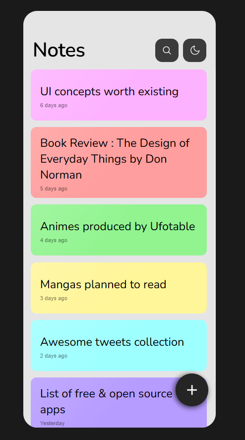
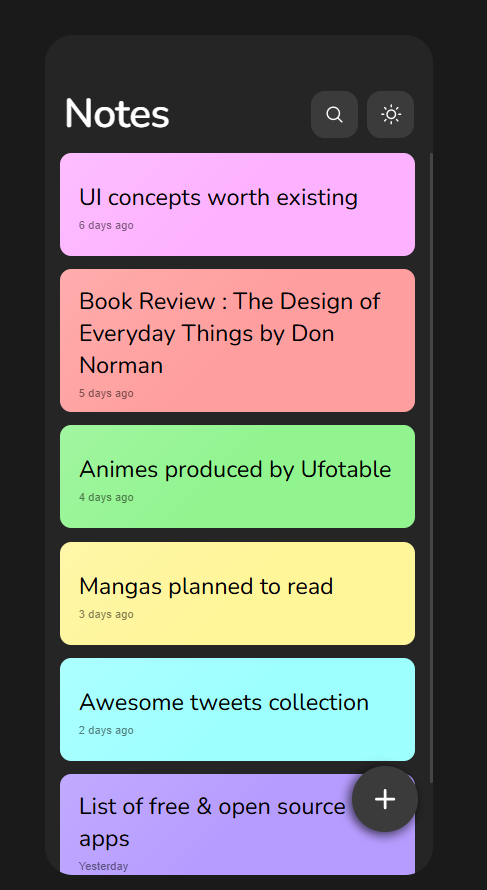
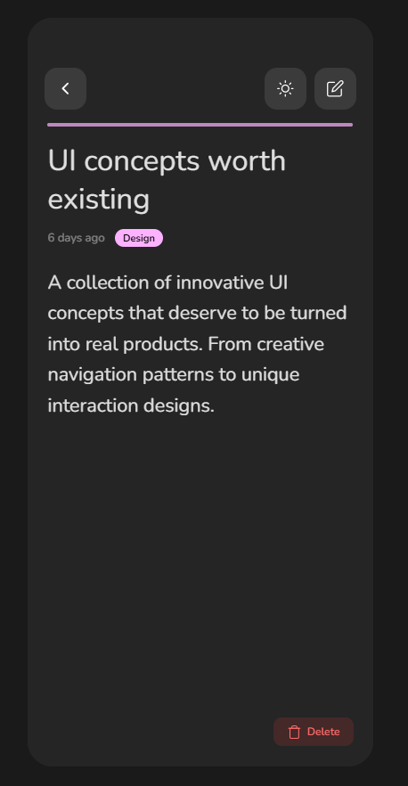
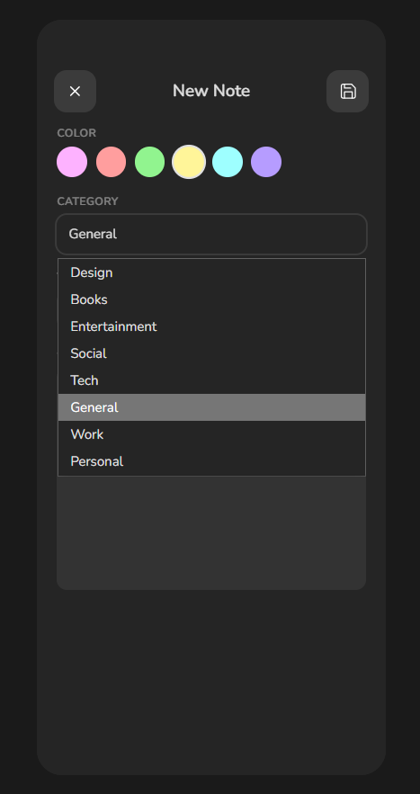

# 📝 Notes App

A beautiful, fully responsive notes application built with **React + TypeScript + Vite**, inspired by a Figma community design. Features fluid responsive sizing, dark mode, smooth animations, and full CRUD with localStorage persistence.

## ✨ Features

| Feature | Description |
|---------|-------------|
| **📝 Create Notes** | Add new notes with a title, content, category, and color |
| **✏️ Edit Notes** | Update existing notes — change title, content, category, or color |
| **🗑️ Delete Notes** | Remove notes with a confirmation dialog |
| **🎨 Color Coding** | 6 color options (pink, salmon, green, yellow, teal, purple) |
| **📂 Categories** | Organize notes by category (General, Work, Personal, Ideas, Recipes) |
| **🌙 Dark Mode** | Toggle between light and dark themes |
| **🔍 Search** | Search notes by title or content in real-time |
| **💾 Local Storage** | All notes persist automatically in your browser |
| **📱 Fully Responsive** | Optimized for all screen sizes — iPhone SE to tablets |
| **✨ Smooth Animations** | Direction-aware page transitions, staggered card entries, micro-interactions |
| **🎬 Intro Animation** | Splash screen with animated logo on first load |

## 🎯 Responsive Design

The app scales fluidly across all smartphone sizes:

| Device | Width | Behavior |
|--------|-------|----------|
| **iPhone SE / small phones** | < 375px | Compact spacing, smaller fonts, full-width layout |
| **iPhone 14 Pro / standard** | 375–430px | Fluid scaling via `clamp()` with viewport-relative values |
| **iPhone Pro Max / large** | 430px+ | Design max size with rounded corners |
| **Landscape mode** | Any | Compact headers, smaller cards, optimized layout |
| **Tablets** | > 768px | Centered card with margin and rounded corners |

## 📸 Screenshots

| Light Mode | Dark Mode | Note Detail | Edit Note |
|:-----------:|:----------:|:-----------:|:---------:|
|  |  |  |  |


## 🚀 Getting Started

### Prerequisites

- **Node.js** v18+ (recommended)
- **npm**, **yarn**, or **pnpm**

### Installation

```bash
# Clone the repository
git clone https://github.com/MuhammadAwais047/Note_App.git
cd Note_App

# Install dependencies
npm install

# Start the development server
npm run dev
```

Open [http://localhost:5173](http://localhost:5173) in your browser.

### Build for Production

```bash
npm run build
```

The output will be in the `dist/` folder.

## 🏗️ Project Structure

```
Note_App/
├── public/                  # Static assets & screenshots
│   ├── screenshot-home.png
│   ├── screenshot-dark.png
│   ├── screenshot-detail.png
│   └── screenshot-edit.png
├── src/
│   ├── hooks/
│   │   └── useNotes.ts      # Custom hook for CRUD + localStorage
│   ├── App.tsx              # Main app component with all screens
│   ├── App.css              # Complete styles (responsive, animations, themes)
│   ├── data.ts              # Types, seed data, and constants
│   ├── index.css            # Global reset and base styles
│   └── main.tsx             # Entry point
├── index.html
├── package.json
├── tsconfig.json
└── vite.config.ts
```

## 🛠️ Tech Stack

- **React 19** — UI library
- **TypeScript** — Type safety
- **Vite** — Build tool & dev server
- **Nunito** — Font from Google Fonts

## 🎨 Design

Based on the [Notes App UI](https://www.figma.com/community/file/1014161465589596715) Figma community design. All screen dimensions, colors, spacing, and typography are adapted from the original design with responsive enhancements.

## 📄 License

This project is open source and available under the [MIT License](LICENSE).

---

*Built with ❤️ using React + TypeScript + Vite*
